# BidBuzz / SHAH Project Diagrams

These Mermaid diagrams are prepared for project documentation. They cover the main diagrams usually required in a final defence report: system architecture, use case, ERD, class relationships, data flow, activity flow, and sequence diagrams.

## 1. System Architecture Diagram

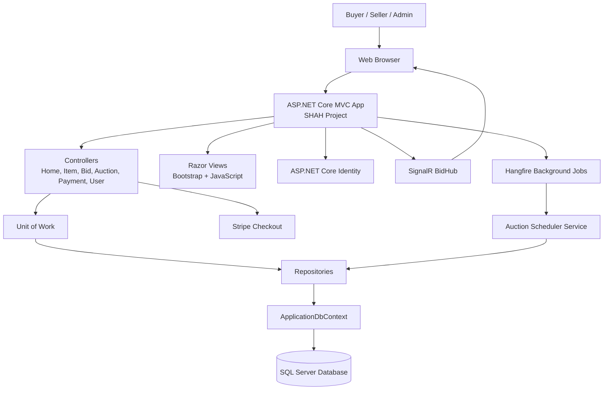

## 2. Use Case Diagram

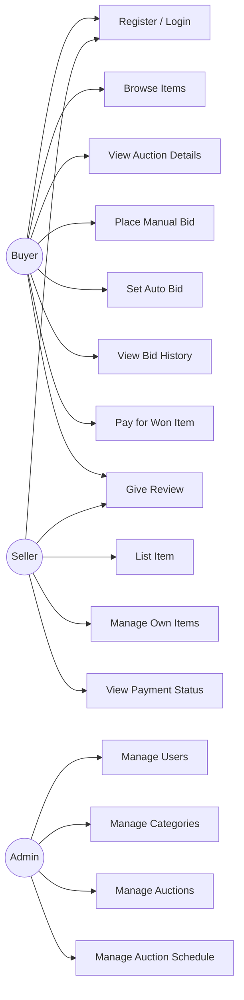

## 3. Entity Relationship Diagram

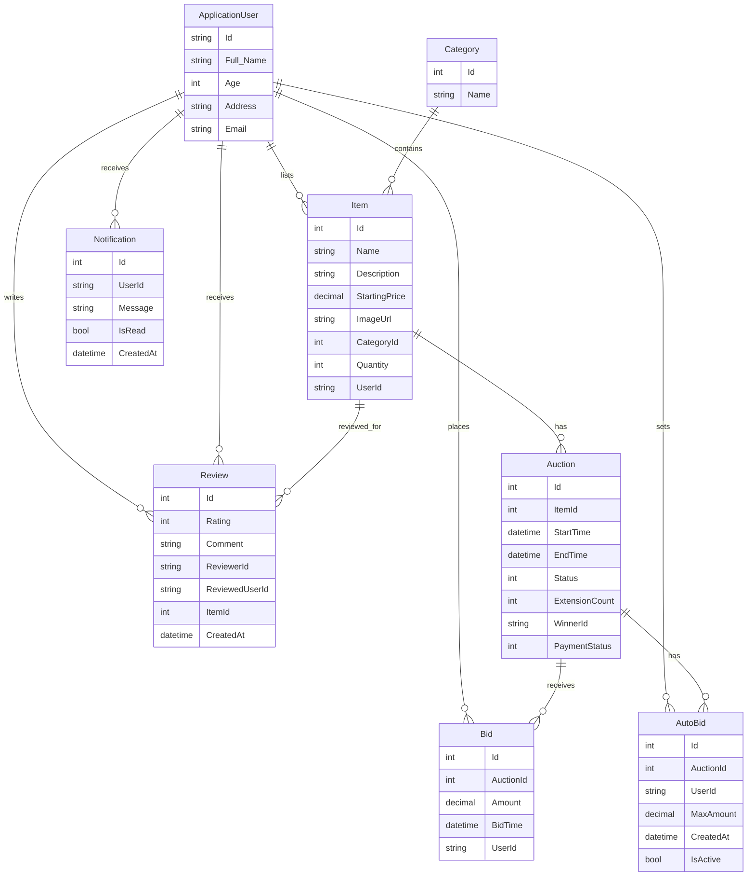

## 4. Data Flow Diagram - Level 0

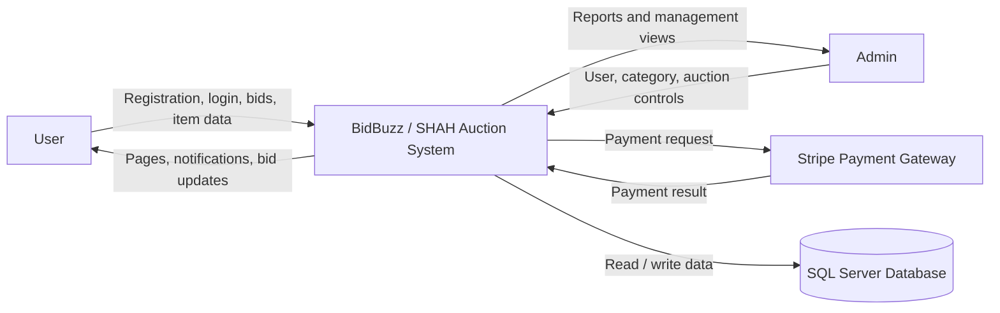

## 5. Data Flow Diagram - Level 1

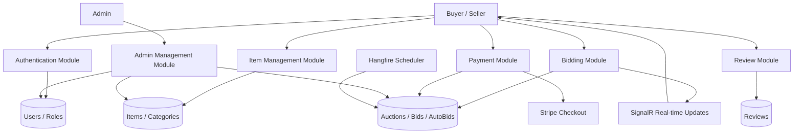

## 6. Auction Bidding Sequence Diagram

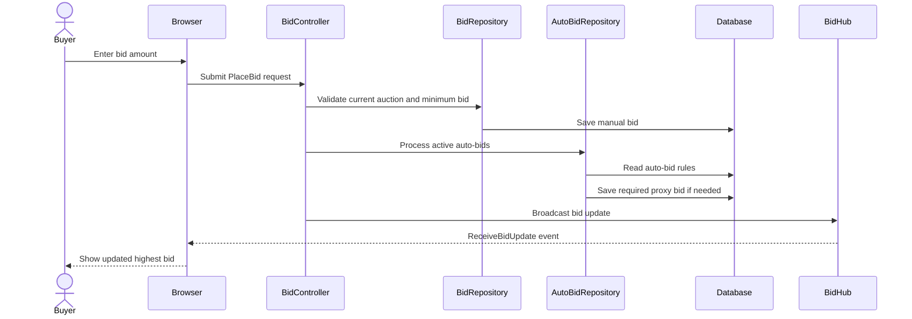

## 7. Auto Bidding Activity Diagram

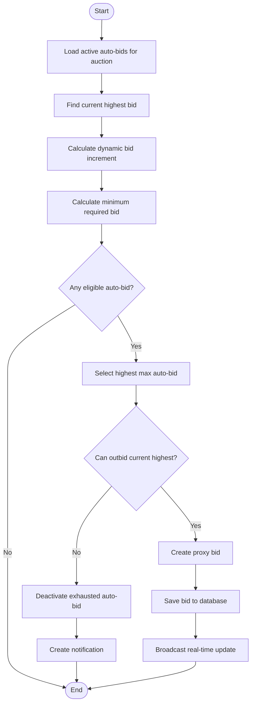

## 8. Auction Lifecycle Activity Diagram

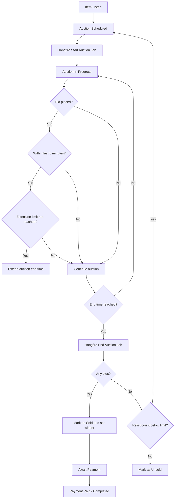

## 9. Payment Sequence Diagram

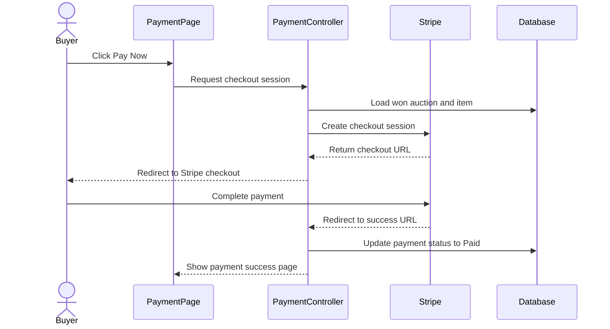

## 10. Review Sequence Diagram

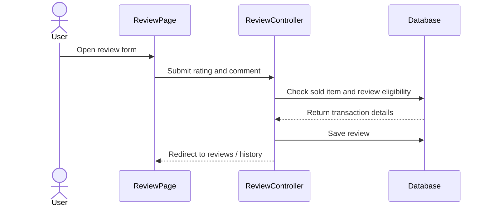

## 11. Class Relationship Diagram

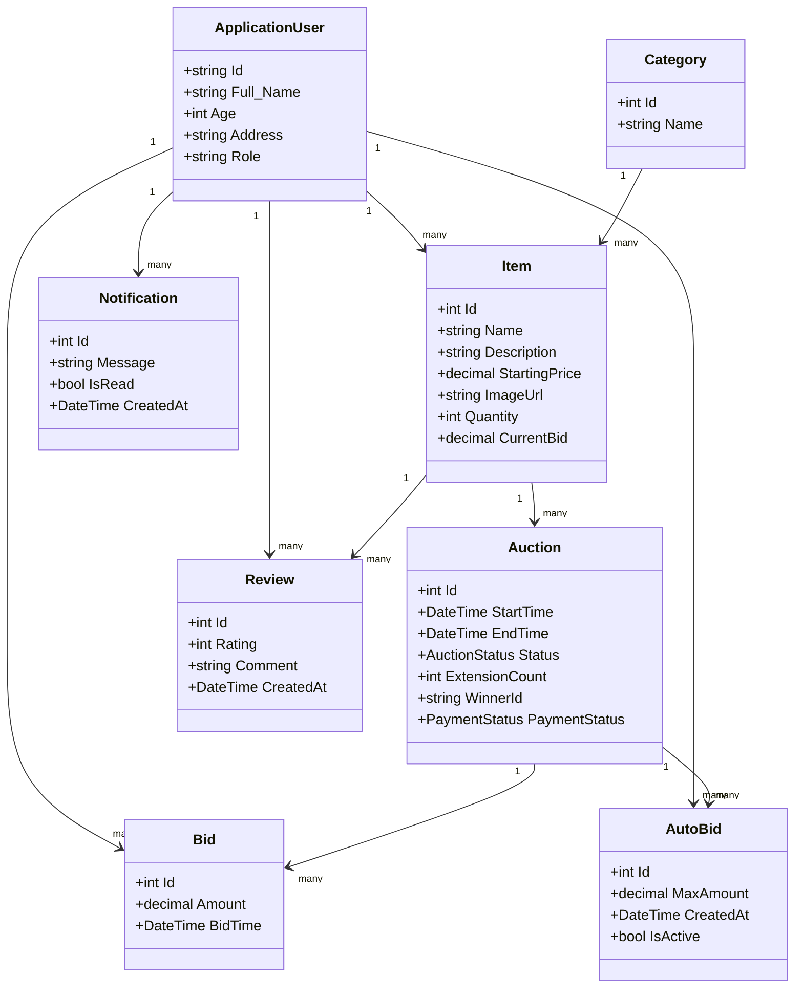

